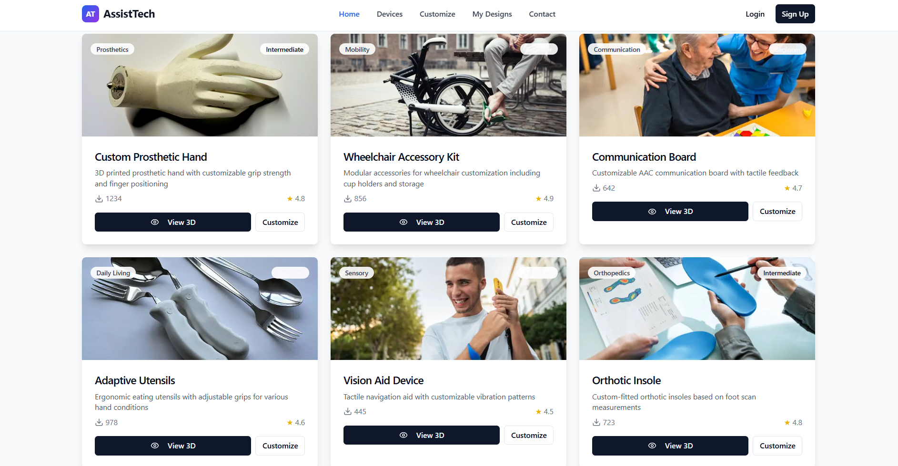
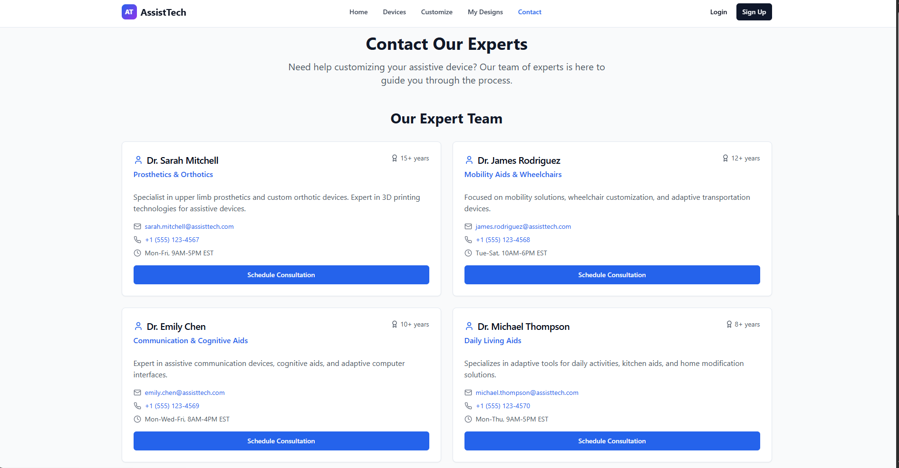
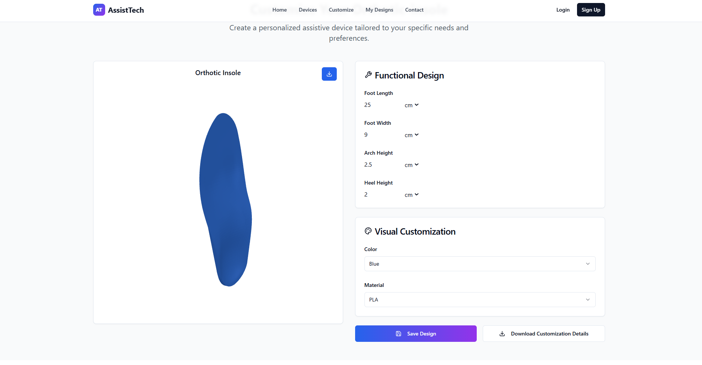

# Adapt Aid Design Hub

A modern web application for browsing, customizing, and managing assistive device designs. This platform enables users to explore adaptive equipment like wheelchairs and orthotics, customize designs to meet individual needs, and save their personalized designs.

## Features

- **Device Browsing**: Explore a catalog of assistive devices with interactive 3D model viewing
- **Customization**: Personalize device designs with an intuitive customization interface
- **Design Management**: Save, manage, and revisit your custom designs
- **User Authentication**: Secure login and registration system
- **3D Model Viewer**: Interactive 3D visualization of devices using Google Model Viewer
- **Responsive Design**: Fully responsive interface that works on desktop and mobile devices

## Tech Stack

- **Frontend Framework**: React 18+ with TypeScript
- **Build Tool**: Vite
- **UI Components**: shadcn-ui with Radix UI primitives
- **Styling**: Tailwind CSS with PostCSS
- **3D Visualization**: Google Model Viewer, Three.js with @react-three/fiber
- **Form Management**: React Hook Form
- **Data Fetching**: TanStack React Query
- **Routing**: React Router
- **Development**: ESLint for code quality

## Getting Started

### Prerequisites

- Node.js 16+ and npm/bun installed
- Git for version control

### Installation

1. **Clone the repository**
   ```bash
   git clone <repository-url>
   cd adapt-aid-design-hub
   ```

2. **Install dependencies**
   ```bash
   npm install
   # or with bun
   bun install
   ```

3. **Start the development server**
   ```bash
   npm run dev
   ```
   The application will be available at `http://localhost:5173`

### Available Scripts

- `npm run dev` - Start development server with hot reload
- `npm run build` - Build for production
- `npm run build:dev` - Build in development mode
- `npm run preview` - Preview production build
- `npm run lint` - Run ESLint to check code quality

## Project Structure

```
src/
├── components/          # React components
│   ├── ui/            # shadcn-ui components
│   ├── Device3DViewer.tsx
│   ├── DeviceGrid.tsx
│   ├── Navigation.tsx
│   └── Footer.tsx
├── pages/             # Page components
│   ├── Devices.tsx
│   ├── Customize.tsx
│   ├── MyDesigns.tsx
│   ├── DeviceDetail.tsx
│   ├── Contact.tsx
│   ├── Login.tsx
│   └── SignUp.tsx
├── hooks/             # Custom React hooks
├── lib/               # Utility functions
├── types/             # TypeScript type definitions
└── main.tsx           # Application entry point
```

## Development

### Code Style

This project uses ESLint for maintaining code quality. Run the linter with:
```bash
npm run lint
```

### Building for Production

To create an optimized production build:
```bash
npm run build
```

The build output will be in the `dist/` directory.

## Contributing

1. Create a feature branch (`git checkout -b feature/amazing-feature`)
2. Commit your changes (`git commit -m 'Add amazing feature'`)
3. Push to the branch (`git push origin feature/amazing-feature`)
4. Open a Pull Request

## License

This project is licensed under the MIT License - see the LICENSE file for details.

## 📸 Project Screenshots

### 🏠 Homepage
<p align="center">
  
</p>

### 🏠 Homepage (Alternate View)
<p align="center">
  
</p>

### 📞 Contact Page
<p align="center">
  
</p>

### ⚙️ Customization Page
<p align="center">
  
</p>

### 🧩 3D Model Viewer
<p align="center">
  
</p>

## Support

For questions or issues, please open an issue on the repository or contact the development team through the Contact page.
